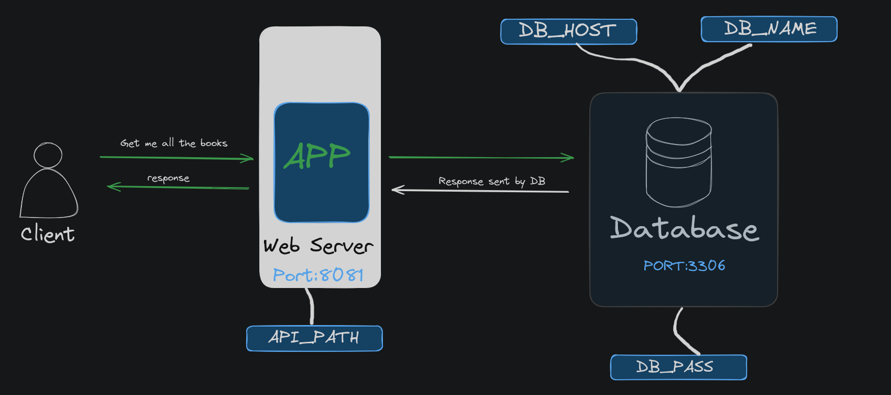

# REST-API 

### A Rest-API written in Go


## 1. Overview

This is a Representational State Transfer Application Programming Interface (REST-API) wriiten in Go that is used to perform the CRUD operations, using MySQL as the database to store the data. 

## 2. Architecture



## 3. Run the application locally

In order to run this application locally, follow the below steps:

1. Start with exporting the  following environment variables: `DB_HOST`, `DB_NAME`, `DB_PASS` and `API_PATH`
   - `DB_HOST` is used to specify the host name your mysql database will be running at
   - `DB_NAME` is the database name you'd like to create.
   - `DB_PASS` is the password that you'll be using to interact with MySQL Database
   - `API_PATH` is the api path you'd like to configure for your own specific need.
    **If you don't specify the environment variables, the default value will be taken in consideration.**

    `DB_HOST` - localhost:3306
    `DB_NAME` - library
    `DB_PASS` - my-default-password
    `API_PATH` - /apis/v1/books

    It is recommended to set the env variable for `DB_PASS` in order to interact with your MySQL Datbase.

2. Once you're able to interact with your MySQL instance, it's time to create the database and table within it. Refer to [sql.sh](./scripts/sql.sh) file and execute the commands.

3. It's time to run the application. Use the following command to build the binary
   
    ```
    go build -o app ./cmd/app/main.go
    ```

4. Execute the binary using the following command
   ```
   ./app
   ```

Your application is running on the port `localhost:8081`

## 4. Test the application locally

1. Get all the books
   ```
   curl -H "Content-Type: application/json" http://localhost:8081/{API_PATH}
   ```
2. Get a specific book. You can do this by passing the id in the query
   ```
   curl -H "Content-Type: application/json" http://localhost:8081/{API_PATH}/{id}
   ```
3. Create a new book
   ```
    curl -X POST \
    -H "Content-Type: application/json" \
    -d '{
        "id": "12",
        "name": "John Doe",
        "isbn": "1234567890"
      }' \
    http://localhost:8081/{API_PATH}
   ```
4. Update an existing book by passing the `id` in the query
    ```
    curl -X PUT \
    -H "Content-Type: application/json" \
    -d '{
        "id": "Updated Book Title",
        "name": "Updated name",
        "isbn": "9876543210"
      }' \
    http://localhost:8081/{API_PATH}/{id}
    ```
5. Delete all the books 
    ```
    curl -X DELETE \
    -H "Content-Type: application/json" http://localhost:8081/{API_PATH}
    ```

6. Delete a specific book by using its id
   ```
   curl -X DELETE \
   -H "Content-Type: application/json" \
   http://localhost:8081/{API_PATH}/{id}
   ```

## 5. How to contribute?

Thank you for considering contributing to this project! We welcome your contributions and support in making this project better.

Contributions are welcome in the form of bug reports, feature requests, code changes, documentation updates, and more. To get started, please follow these steps:

1. **Create an Issue:**

   - If you find a bug or have a feature request, please create an issue.
   - Provide as much detail as possible, including the version of the project where you encountered the issue, your operating system, and steps to reproduce the problem.

2. **Fork the Repository:**

   - If you plan to make code contributions, fork the repository to your GitHub account.

3. **Make Changes:**

   - Create a new branch for your changes: `git checkout -b feature/your-feature` or `fix/your-fix`.
   - Make your changes, ensuring that your code follows the project's coding guidelines and standards.

4. **Test Your Changes:**

   - Ensure that your changes work as expected and do not introduce new issues.

5. **Submit a Pull Request:**

   - When you're ready to submit your changes, create a pull request from your fork to the main repository's `master` branch (or the relevant target branch).
   - In the pull request, provide a clear description of your changes and reference any related issues.

6. **Code Review:**

   - Your pull request will be reviewed by project maintainers. Please be responsive to any feedback or requested changes.

7. **Merge and Release:**
   - Once your changes are approved, they will be merged into the project. 
